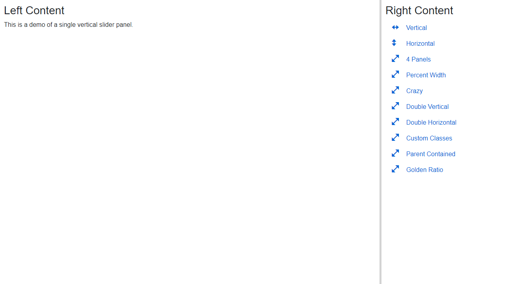
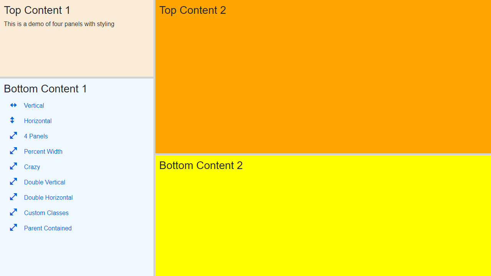
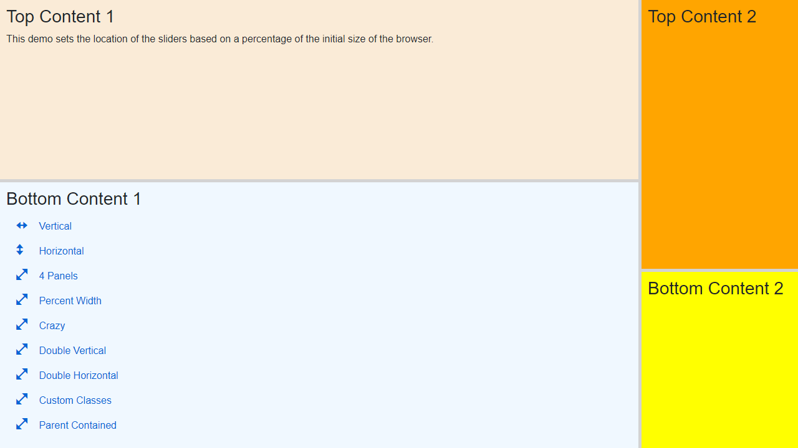
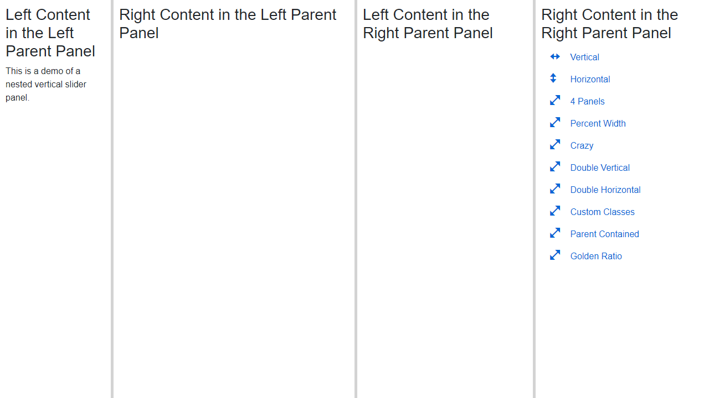
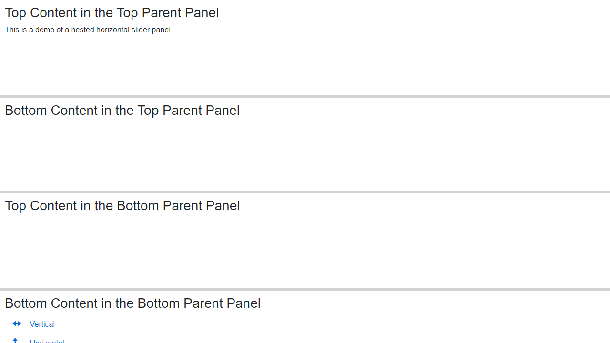

#  BlazorSliders

[](https://www.nuget.org/packages/BlazorSliders/)

Create multiple panels separated by sliding splitters.

Github: https://github.com/carlfranklin/BlazorSliders

<!-- toc -->
## Contents

  * [Live Demo:](#live-demo)
  * [YouTube Demo (BlazorTrain):](#youtube-demo-blazortrain)
  * [Description](#description)
  * [Usage](#usage)
    * [Simple Vertical Split:](#simple-vertical-split)
    * [Simple Horizontal Split:](#simple-horizontal-split)
    * [Four Panels:](#four-panels)
    * [Initial size and position based on percent size of browser:](#initial-size-and-position-based-on-percent-size-of-browser)
    * [Complex Nesting:](#complex-nesting)
    * [NavMenu used in demos:](#navmenu-used-in-demos)
  * [Icon](#icon)<!-- endToc -->


## Live Demo:

https://blazorslidertest.azurewebsites.net/


## YouTube Demo (BlazorTrain):

https://youtu.be/fNDd7moZJ4c


## Description

There are four main components:


#### AbsolutePanel

AbsolutePanel is the container for a page. It provides events for when the window is resized.


#### Window

Window is used by the AbsolutePanel but can also be used on its own. It provides an event for when the window (browser) is resized, passing the Width and Height.


#### VerticalSliderPanel

Provides two content components and a vertical splitter between the two. Handles all UI requirements.


#### HorizontalSliderPanel

Provides two content components and a horizontal splitter between the two. Handles all UI requirements.


## Usage

Add to *_Imports.razor*:

```c#
@using BlazorSliders
```

Change your *\Shared\MainLayout.razor* to the following:

```
@inherits LayoutComponentBase
@Body
```

**For Blazor Server:**

`ServerPrerendered` is not supported. 

In your *_Hosts.cshtml* file, set the following:

```xml
<component type="typeof(App)" render-mode="Server" />
```

For .NET 6 projects, in your *_Hosts.cshtml* file, set the following:

```xml
<component type="typeof(HeadOutlet)" render-mode="Server" />
```

In .NET 5: Add the following line to `ConfigureServices` in *Startup.cs* :

<!-- snippet: AddSliderInteropServer -->
<a id='snippet-AddSliderInteropServer'></a>
```cs
services.AddScoped<SliderInterop>();
```
<sup><a href='/BlazorSlidersTest/Startup.cs#L32-L34' title='Snippet source file'>snippet source</a> | <a href='#snippet-AddSliderInteropServer' title='Start of snippet'>anchor</a></sup>
<!-- endSnippet -->

In .NET 6: Add the following to *Program.cs*:

<!-- snippet: AddSliderInteropServer -->
<a id='snippet-AddSliderInteropServer'></a>
```cs
services.AddScoped<SliderInterop>();
```
<sup><a href='/BlazorSlidersTest/Startup.cs#L32-L34' title='Snippet source file'>snippet source</a> | <a href='#snippet-AddSliderInteropServer' title='Start of snippet'>anchor</a></sup>
<!-- endSnippet -->


**For Blazor WebAssembly:**

Add the following to `Main()` in *Program.cs*:

<!-- snippet: AddSliderInteropWasm -->
<a id='snippet-AddSliderInteropWasm'></a>
```cs
builder.Services.AddScoped<SliderInterop>();
```
<sup><a href='/BlazorSliderTestWasm/Program.cs#L22-L24' title='Snippet source file'>snippet source</a> | <a href='#snippet-AddSliderInteropWasm' title='Start of snippet'>anchor</a></sup>
<!-- endSnippet -->


### Simple Vertical Split:

<!-- snippet: BlazorSliderTestWasm/Pages/Index.razor -->
<a id='snippet-BlazorSliderTestWasm/Pages/Index.razor'></a>
```razor
@page "/"

<AbsolutePanel AutoResize="true">
    <VerticalSliderPanel LeftPanelStartingWidth="400">
        <LeftChildContent>
            <div style="padding:10px;">
                <h3>Left Content</h3>
                This is a demo of a single vertical slider panel.
            </div>
        </LeftChildContent>
        <RightChildContent>
            <div style="padding:10px;">
                <h3>Right Content</h3>
                <NavMenu />
            </div>
        </RightChildContent>
    </VerticalSliderPanel>
</AbsolutePanel>
```
<sup><a href='/BlazorSliderTestWasm/Pages/Index.razor#L1-L19' title='Snippet source file'>snippet source</a> | <a href='#snippet-BlazorSliderTestWasm/Pages/Index.razor' title='Start of snippet'>anchor</a></sup>
<!-- endSnippet -->

<kbd></kbd>


### Simple Horizontal Split:

<!-- snippet: BlazorSliderTestWasm/Pages/Horizontals.razor -->
<a id='snippet-BlazorSliderTestWasm/Pages/Horizontals.razor'></a>
```razor
@page "/horizontals"

<AbsolutePanel AutoResize="true">
    <HorizontalSliderPanel TopPanelHeight="200">
        <TopChildContent>
            <div style="padding:10px;">
                <h3>Top Content</h3>
                This is a demo of a single horizontal slider panel.
            </div>
        </TopChildContent>
        <BottomChildContent>
            <div style="padding:10px;">
                <h3>Bottom Content</h3>
                <NavMenu />
            </div>
        </BottomChildContent>
    </HorizontalSliderPanel>
</AbsolutePanel>
```
<sup><a href='/BlazorSliderTestWasm/Pages/Horizontals.razor#L1-L18' title='Snippet source file'>snippet source</a> | <a href='#snippet-BlazorSliderTestWasm/Pages/Horizontals.razor' title='Start of snippet'>anchor</a></sup>
<!-- endSnippet -->

<kbd></kbd>


### Four Panels:

<!-- snippet: BlazorSliderTestWasm/Pages/FourPanels.razor -->
<a id='snippet-BlazorSliderTestWasm/Pages/FourPanels.razor'></a>
```razor
@page "/fourpanels"

<AbsolutePanel AutoResize="true">
    <VerticalSliderPanel LeftPanelStartingWidth="400">
        <LeftChildContent>
            <HorizontalSliderPanel PanelPosition="PanelPosition.Left"
                                   TopStyleString="background-color:antiquewhite;"
                                   BottomStyleString="background-color:aliceblue;"
                                   TopPanelHeight="200">
                <TopChildContent>
                    <div style="padding:10px;">
                        <h3>Top Content 1</h3>
                        This is a demo of four panels with styling
                    </div>
                </TopChildContent>
                <BottomChildContent>
                    <div style="padding:10px;">
                        <h3>Bottom Content 1</h3>
                        <NavMenu />
                    </div>
                </BottomChildContent>
            </HorizontalSliderPanel>
        </LeftChildContent>
        <RightChildContent>
            <HorizontalSliderPanel PanelPosition="PanelPosition.Right"
                                   TopStyleString="background-color:orange;"
                                   BottomStyleString="background-color:yellow;"
                                   TopPanelHeight="400">
                <TopChildContent>
                    <div style="padding:10px;">
                        <h3>Top Content 2</h3>
                    </div>
                </TopChildContent>
                <BottomChildContent>
                    <div style="padding:10px;">
                        <h3>Bottom Content 2</h3>
                    </div>
                </BottomChildContent>
            </HorizontalSliderPanel>
        </RightChildContent>
    </VerticalSliderPanel>
</AbsolutePanel>
```
<sup><a href='/BlazorSliderTestWasm/Pages/FourPanels.razor#L1-L43' title='Snippet source file'>snippet source</a> | <a href='#snippet-BlazorSliderTestWasm/Pages/FourPanels.razor' title='Start of snippet'>anchor</a></sup>
<!-- endSnippet -->

<kbd></kbd>


### Initial size and position based on percent size of browser:

<!-- snippet: BlazorSliderTestWasm/Pages/WindowResize.razor -->
<a id='snippet-BlazorSliderTestWasm/Pages/WindowResize.razor'></a>
```razor
@page "/windowresize"

<Window WindowResized="OnWindowResized" />

@(WindowSize != null)
{
<AbsolutePanel AutoResize="true">
    <VerticalSliderPanel LeftPanelStartingWidth="@VerticalLeftPanelWidth">
        <LeftChildContent>
            <HorizontalSliderPanel PanelPosition="PanelPosition.Left"
                                   TopStyleString="background-color:antiquewhite;"
                                   BottomStyleString="background-color:aliceblue;"
                                   TopPanelHeight="@LeftHorizontalTopPanelHeight">
                <TopChildContent>
                    <div style="padding:10px;">
                        <h3>Top Content 1</h3>
                        This demo sets the location of the sliders based on a percentage of the
                        initial size of the browser.
                    </div>
                </TopChildContent>
                <BottomChildContent>
                    <div style="padding:10px;">
                        <h3>Bottom Content 1</h3>
                        <NavMenu />
                    </div>
                </BottomChildContent>
            </HorizontalSliderPanel>
        </LeftChildContent>
        <RightChildContent>
            <HorizontalSliderPanel PanelPosition="PanelPosition.Right"
                                   TopStyleString="background-color:orange;"
                                   BottomStyleString="background-color:yellow;"
                                   TopPanelHeight="@RightHorizontalTopPanelHeight">
                <TopChildContent>
                    <div style="padding:10px;">
                        <h3>Top Content 2</h3>
                    </div>
                </TopChildContent>
                <BottomChildContent>
                    <div style="padding:10px;">
                        <h3>Bottom Content 2</h3>
                    </div>
                </BottomChildContent>
            </HorizontalSliderPanel>
        </RightChildContent>
    </VerticalSliderPanel>
</AbsolutePanel>
}

@code
{
    Size WindowSize { get; set; } = null;

    int VerticalLeftPanelWidthPercent = 80;
    int LeftHorizontal1TopPanelHeightPercent = 40;
    int RightHorizontal1TopPanelHeightPercent = 60;

    int VerticalLeftPanelWidth
    {
        get
        {
            if (WindowSize != null)
            {
                return WindowSize.Width * VerticalLeftPanelWidthPercent / 100;
            }
            else
                return 0;
        }
    }

    int LeftHorizontalTopPanelHeight
    {
        get
        {
            if (WindowSize != null)
            {
                var height = WindowSize.Height * LeftHorizontal1TopPanelHeightPercent / 100;
                return height;
            }
            else
                return 0;
        }
    }

    int RightHorizontalTopPanelHeight
    {
        get
        {
            if (WindowSize != null)
            {
                var height = WindowSize.Height * RightHorizontal1TopPanelHeightPercent / 100;
                return height;
            }
            else
                return 0;
        }
    }

    void OnWindowResized(Size Size)
    {
        WindowSize = Size;
    }
}
```
<sup><a href='/BlazorSliderTestWasm/Pages/WindowResize.razor#L1-L103' title='Snippet source file'>snippet source</a> | <a href='#snippet-BlazorSliderTestWasm/Pages/WindowResize.razor' title='Start of snippet'>anchor</a></sup>
<!-- endSnippet -->

<kbd></kbd>


### Complex Nesting:

> Note: Vertical nesting in vertical panels and horizontal nesting in horizontal panels has now been implemented as shown below.

#### Vertical Panel Nested in Vertical Panel:

<!-- snippet: BlazorSliderTestWasm/Pages/DoubleVertical.razor -->
<a id='snippet-BlazorSliderTestWasm/Pages/DoubleVertical.razor'></a>
```razor
@page "/doublevertical"

<AbsolutePanel AutoResize="true">
    <VerticalSliderPanel LeftPanelStartingWidth="600">
        <LeftChildContent>
            <VerticalSliderPanel PanelPosition="PanelPosition.Left" LeftPanelStartingWidth="400">
                <LeftChildContent>
                    <div style="padding:10px;">
                        <h3>Left Content in the Left Parent Panel</h3>
                        This is a demo of a nested vertical slider panel.
                    </div>
                </LeftChildContent>
                <RightChildContent>
                    <div style="padding:10px;">
                        <h3>Right Content in the Left Parent Panel</h3>
                    </div>
                </RightChildContent>
            </VerticalSliderPanel>
        </LeftChildContent>
        <RightChildContent>
            <VerticalSliderPanel PanelPosition="PanelPosition.Right" LeftPanelStartingWidth="400">
                <LeftChildContent>
                    <div style="padding:10px;">
                        <h3>Left Content in the Right Parent Panel</h3>
                    </div>
                </LeftChildContent>
                <RightChildContent>
                    <div style="padding:10px;">
                        <h3>Right Content in the Right Parent Panel</h3>
                        <NavMenu />
                    </div>
                </RightChildContent>
            </VerticalSliderPanel>

        </RightChildContent>
    </VerticalSliderPanel>
</AbsolutePanel>
```
<sup><a href='/BlazorSliderTestWasm/Pages/DoubleVertical.razor#L1-L37' title='Snippet source file'>snippet source</a> | <a href='#snippet-BlazorSliderTestWasm/Pages/DoubleVertical.razor' title='Start of snippet'>anchor</a></sup>
<!-- endSnippet -->

<kbd></kbd>

#### Horizontal Panel Nested in Horizontal Panel:

<!-- snippet: BlazorSliderTestWasm/Pages/DoubleHorizontal.razor -->
<a id='snippet-BlazorSliderTestWasm/Pages/DoubleHorizontal.razor'></a>
```razor
@page "/doublehorizontal"

<AbsolutePanel AutoResize="true">
    <HorizontalSliderPanel TopPanelHeight="400">
        <TopChildContent>
            <HorizontalSliderPanel PanelPosition="PanelPosition.Top" TopPanelHeight="200">
                <TopChildContent>
                    <div style="padding:10px;">
                        <h3>Top Content in the Top Parent Panel</h3>
                        This is a demo of a nested horizontal slider panel.
                    </div>
                </TopChildContent>
                <BottomChildContent>
                    <div style="padding:10px;">
                        <h3>Bottom Content in the Top Parent Panel</h3>
                    </div>
                </BottomChildContent>
            </HorizontalSliderPanel>
        </TopChildContent>
        <BottomChildContent>
            <HorizontalSliderPanel PanelPosition="PanelPosition.Bottom" TopPanelHeight="200">
                <TopChildContent>
                    <div style="padding:10px;">
                        <h3>Top Content in the Bottom Parent Panel</h3>
                    </div>
                </TopChildContent>
                <BottomChildContent>
                    <div style="padding:10px;">
                        <h3>Bottom Content in the Bottom Parent Panel</h3>
                        <NavMenu />
                    </div>
                </BottomChildContent>
            </HorizontalSliderPanel>
        </BottomChildContent>
    </HorizontalSliderPanel>
</AbsolutePanel>
```
<sup><a href='/BlazorSliderTestWasm/Pages/DoubleHorizontal.razor#L1-L36' title='Snippet source file'>snippet source</a> | <a href='#snippet-BlazorSliderTestWasm/Pages/DoubleHorizontal.razor' title='Start of snippet'>anchor</a></sup>
<!-- endSnippet -->

<kbd></kbd>

#### Crazy Nesting Inception:

<!-- snippet: BlazorSliderTestWasm/Pages/Crazy.razor -->
<a id='snippet-BlazorSliderTestWasm/Pages/Crazy.razor'></a>
```razor
@page "/crazy"

<AbsolutePanel AutoResize="true">
    <VerticalSliderPanel LeftPanelStartingWidth="400">
        <LeftChildContent>
            <HorizontalSliderPanel PanelPosition="PanelPosition.Left"
                                   TopStyleString="background-color:antiquewhite;"
                                   BottomStyleString="background-color:aliceblue;"
                                   TopPanelHeight="200">
                <TopChildContent>
                    <div style="padding:10px;">
                        <h3>Top Content 1</h3>
                        This is the craziest demo of all
                    </div>
                </TopChildContent>
                <BottomChildContent>
                    <div style="padding:10px;">
                        <h3>Bottom Content 1</h3>
                        <NavMenu />
                    </div>
                </BottomChildContent>
            </HorizontalSliderPanel>
        </LeftChildContent>
        <RightChildContent>
            <HorizontalSliderPanel PanelPosition="PanelPosition.Right"
                                   BottomStyleString="background-color:violet;"
                                   TopPanelHeight="600">
                <TopChildContent>
                    <VerticalSliderPanel PanelPosition="PanelPosition.Top"
                                         LeftPanelStartingWidth="700">
                        <LeftChildContent>
                            <HorizontalSliderPanel PanelPosition="PanelPosition.Left"
                                                   TopStyleString="background-color:orange;"
                                                   BottomStyleString="background-color:lightblue;"
                                                   TopPanelHeight="300">
                                <TopChildContent>
                                    <div style="padding:10px;">
                                        <h3>Top Content 2</h3>
                                    </div>
                                </TopChildContent>
                                <BottomChildContent>
                                    <div style="padding:10px;">
                                        <h3>Bottom Content 2</h3>
                                    </div>
                                </BottomChildContent>
                            </HorizontalSliderPanel>
                        </LeftChildContent>
                        <RightChildContent>
                            <HorizontalSliderPanel PanelPosition="PanelPosition.Right"
                                                   TopStyleString="background-color:pink;"
                                                   BottomStyleString="background-color:lightgreen;"
                                                   TopPanelHeight="400">
                                <TopChildContent>
                                    <div style="padding:10px;">
                                        <h3>Top Content 3</h3>
                                    </div>
                                </TopChildContent>
                                <BottomChildContent>
                                    <div style="padding:10px;">
                                        <h3>Bottom Content 3</h3>
                                    </div>
                                </BottomChildContent>
                            </HorizontalSliderPanel>
                        </RightChildContent>
                    </VerticalSliderPanel>
                </TopChildContent>
                <BottomChildContent>
                    <div style="padding:10px;">
                        <h3>Bottom Content 4</h3>
                    </div>
                </BottomChildContent>
            </HorizontalSliderPanel>
        </RightChildContent>
    </VerticalSliderPanel>
</AbsolutePanel>
```
<sup><a href='/BlazorSliderTestWasm/Pages/Crazy.razor#L1-L75' title='Snippet source file'>snippet source</a> | <a href='#snippet-BlazorSliderTestWasm/Pages/Crazy.razor' title='Start of snippet'>anchor</a></sup>
<!-- endSnippet -->

<kbd></kbd>


### NavMenu used in demos:

<!-- snippet: BlazorSliderTestWasm/Shared/NavMenu.razor -->
<a id='snippet-BlazorSliderTestWasm/Shared/NavMenu.razor'></a>
```razor
<div>
    <NavLink class="nav-link" href="" Match="NavLinkMatch.All">
        <span class="oi oi-resize-width" aria-hidden="true"></span> Vertical
    </NavLink>
    <NavLink class="nav-link" href="horizontals">
        <span class="oi oi-resize-height" aria-hidden="true"></span> Horizontal
    </NavLink>
    <NavLink class="nav-link" href="fourpanels">
        <span class="oi oi-resize-both" aria-hidden="true"></span> 4 Panels
    </NavLink>
    <NavLink class="nav-link" href="windowresize">
        <span class="oi oi-resize-both" aria-hidden="true"></span> Percent Width
    </NavLink>
    <NavLink class="nav-link" href="crazy">
        <span class="oi oi-resize-both" aria-hidden="true"></span> Crazy
    </NavLink>
    <NavLink class="nav-link" href="doublevertical">
        <span class="oi oi-resize-both" aria-hidden="true"></span> Double Vertical
    </NavLink>
    <NavLink class="nav-link" href="doublehorizontal">
        <span class="oi oi-resize-both" aria-hidden="true"></span> Double Horizontal
    </NavLink>
</div>
```
<sup><a href='/BlazorSliderTestWasm/Shared/NavMenu.razor#L1-L23' title='Snippet source file'>snippet source</a> | <a href='#snippet-BlazorSliderTestWasm/Shared/NavMenu.razor' title='Start of snippet'>anchor</a></sup>
<!-- endSnippet -->


## Icon

[slide](https://thenounproject.com/term/slide/3631831/) designed by [Eucalyp](https://thenounproject.com/eucalyp) from [The Noun Project](https://thenounproject.com/). Licensed under [Creative Commons](https://creativecommons.org/licenses/by/3.0/us/legalcode).
